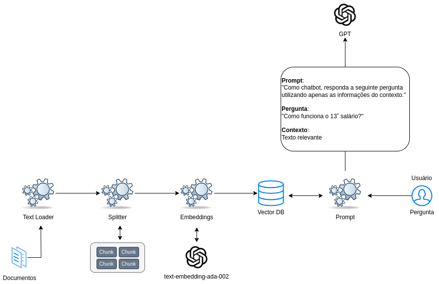

# IA para Devs

Registrei aqui algumas notas que tomei enquanto assistia conteúdos sobre LLMs.

## LLMs

LLMs (large language models) são modelos de aprendizado profundo (Deep Learning) com bilhões de parâmetros que se destacam em uma ampla gama de tarefas de processamento de linguagem natural (NLP).  
Podem ser utilizados sem a necessidade ajustes finos (fine-tuning), empregando técnicas de "prompting".

## Modelos de treinamento

- [Fine-tuning](https://platform.openai.com/docs/guides/fine-tuning)
  - Analogia: memória de longo prazo, corre o risco de "dar branco" (vai responder apenas com base no que foi treinado, não recebe novas informações de contexto no prompt).
  - Bom pra quando temos uma base de perguntas e respostas. Modelo aprende com esse histórico e passa a responder novas perguntas (requer um investimento cuidadoso de tempo e esforço) ([casos de uso comuns](https://platform.openai.com/docs/guides/fine-tuning/common-use-cases)).

- [Embeddings-based search](https://platform.openai.com/docs/guides/prompt-engineering/tactic-use-embeddings-based-search-to-implement-efficient-knowledge-retrieval)
  - Analogia: memória de curto prazo, "prova com consulta" (recebe no prompt um contexto que deve conter informação útil para montar a resposta).
  - Utilizado quando não existe um histórico de perguntas e respostas e a IA precisa aprender em um material bruto/arquivos privados como um artigo, PDF, etc.
  - Ao incrementar o LLM com um mecanismo de pesquisa, não precisamos mais treinar/customizar um modelo (fine-tuning) com dados específicos. Este método também é conhecido como `Retrieval-augmented Generation (RAG)`.

## O prompt

- É toda a instução que a gente passa pra IA, ajudando-a a compreender o contexto e a gerar resultados relevantes.
- Com o modelo de treinamento embeddings-based search, o contexto necessário para responder a pergunta do usuário deve ser adicionado ao [prompt](https://python.langchain.com/docs/modules/model_io/prompts/).
- É muito importante escrever/otimizar os prompts para obter boas respostas ([prompt engineering](https://platform.openai.com/docs/guides/prompt-engineering)).

## Texto vs Semântica

Semântica é um ramo da linguística que estuda o significado das palavras, frases e textos de uma língua.

Por exemplo, se eu tiver a transcrição de todas as videoaulas de uma plataforma de ensino, como encontrar a transcrição perfeita para responder a pergunta do usuário?  
Resposta: `Busca semântica`.

### [Embeddings](https://platform.openai.com/docs/introduction/embeddings)

- São representações semânticas de um pedaço de texto, representadas através de um vetor numérico.  
- Existem modelos treinados para classificação semântica, ou seja, categoriza as palavras em um contexto conforme o seu significado.  
Ex: "isso não ficou legal" - "pow legal, ficou demais": o significado de legal muda.  
Com esse vetor numérico em mãos, podemos calcular a distância semântica entre dois textos.
- Modelo mais famoso de representação semântica: [OpenAI ADA](https://openai.com/blog/new-and-improved-embedding-model) - cria embeddings - tem 1536 dimensoes! (por comparação, uma matriz tem 2 dimensões).  
Exemplo: modelo pode ter palavras como cachorro, gato, lobo, galinha... o usuário digita cão, o modelo vai calcular nas dimensões qual palavra está mais proxima de cão (cálculo de distância - a distância entre dois vetores mede sua relação).
- Bancos de dados especializados em armazenar embeddings:
  - https://byby.dev/vector-databases
  - https://platform.openai.com/docs/guides/embeddings/how-can-i-retrieve-k-nearest-embedding-vectors-quickly
- Similaridade por cosseno (cosine similarity) é uma medida da similaridade de entre dois vetores num espaço vetorial que avalia o valor do cosseno do ângulo compreendido entre eles. É frequentemente usado para medir a similaridade de documentos na análise de texto.

### [Tokens](https://platform.openai.com/docs/introduction/tokens)

Tokenização é um princípio fundamental no processamento de linguagem natural (NLP) que desempenha um papel crucial em permitir que modelos de linguagem compreendam informações escritas.

- Os modelos de geração de texto e embeddings processam o texto em pedaços chamados tokens.
- São pedaços de palavras formados por, em média, 4 letras no dicionário inglês.
- Geralmente a gente paga por token, que vai afetar o processamento. O custo da pergunta é baseado na quantidade de tokens utilizada.
- O limite de tokens é dividido entre o prompt e a resposta, ou seja, o texto que envio (contexto+pergunta) e o texto da resposta (a soma deles) não pode ultrapassar o limite de tokens do modelo.
- Como token afeta custo, evitar usar token/texto desnecessários.
- Python lib tiktoken permite calcular quantidade de tokens de um texto.
- Posso limitar pela API ChatGPT qual o máximo de tokens ele vai usar.

Pesquisadores incorporaram três abordagens de codificação distintas:

- Nível de caractere: Cada caractere é considerado como um token.
- Nível de palavra: Codificar cada palavra como um token.
- Nível de subpalavra: Quebrar uma palavra em pedaços menores sempre que possível. Por exemplo, podemos codificar a palavra “basketball” na combinação de dois tokens como “basket” + “ball”.

A codificação em nível de subpalavra oferece maior flexibilidade e reduz o número de tokens únicos necessários para representar um texto, pois possibilita a combinação de diferentes tokens para representar novas palavras, eliminando a necessidade de adicionar cada nova palavra ao dicionário.

Um dos algoritmos usados para extrair as palavras ou subpalavras mais repetidas em um texto é o Byte Pair Encoding (BPE), que conta a ocorrência de cada caractere e se baseia nisso mesclando os caracteres. É um processo que considera todas as combinações possíveis para identificar o conjunto ideal de palavras/subpalavras que cobre o conjunto de dados com o menor número de tokens necessários.

### Chunks

- Se existe um limite de tokens dividido entre prompt e resposta, como lidar com textos muito grandes?
- A solução é criar chunks, ou seja, pedaços do texto que podem individualmente responder perguntas do usuário.  
Com isso economizamos no tamanho do prompt, enviando apenas a parte do texto que mais interessa.
Além disso, facilita enviar o contexto de mais de uma fonte, ou seja, dois pedaços de textos/fontes diferentes podem ser dados como contexto no prompt.
- Posso limitar o tamanho de tokens por chunk e, por exemplo, enviar no prompt até 3 chunks como contexto.
- Tem que fazer busca semântica nos chunks pra saber quais chunks enviar como contexto para a AI.
- Isso vai ficar na empresa, seus dados privados, e você pode alimentar o prompt com o contexto necessário para que o LLM gere as respostas.
- Então na empresa você precisa ter uma aplicação que consome o conteúdo/texto, gera e armazena a representação semântica (embeddings).
- ChatGPT tem parâmetro para a resposta vir como streaming, não precisando aguardar ele formar todo o texto pra devolver a resposta ao usuário.

## Uma ideia do fluxo com Retrieval-augmented Generation (RAG)

## Referências externas

- https://python.langchain.com/docs/use_cases/question_answering/
- https://www.gradio.app/guides/quickstart
- https://docs.chainlit.io/overview
- https://python.langchain.com/docs/get_started
- [Live Rocketseat: Busca semântica com IA (LangChain + Embeddings) | Aquecimento IA para devs](https://www.youtube.com/watch?v=1pFb0AOLpYo)
- [Live Rocketseat: Conversar com um PDF usando IA? (Meta LLAMA v2, novo modelo da Meta)](https://www.youtube.com/watch?v=xtbYqof3ErY)
- https://github.com/thiagomdiniz/llamav2_local